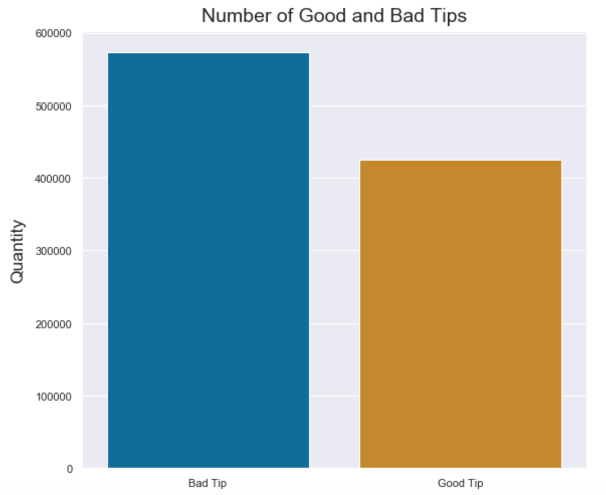
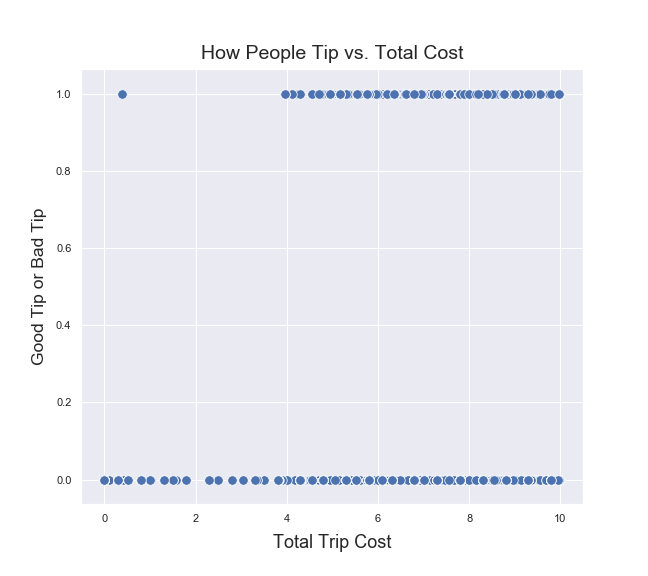
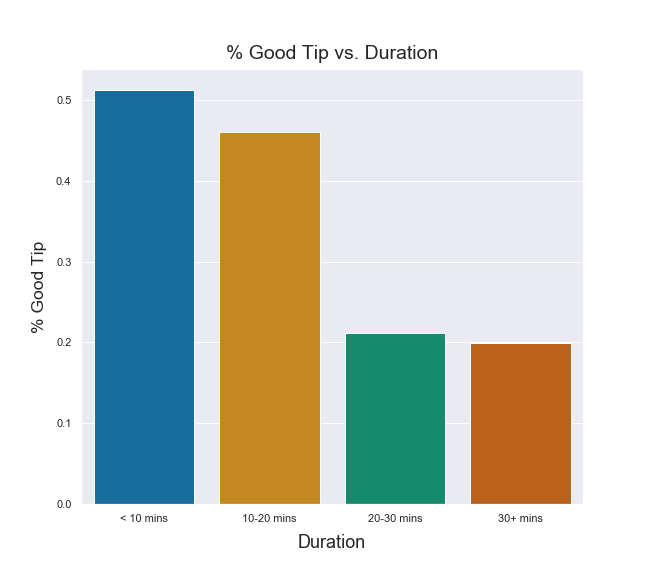

# **Currently a work in progress**

# YellowTaxiTips
This project aims to determine whether or not a yellow taxi driver would get a good tip.
The data contains information such as the trip's duration, distance, pickup and dropoff locations, etc. The data used can be found in the April 2019 dataset from https://www1.nyc.gov/site/tlc/about/tlc-trip-record-data.page

- [Project Goal](#ProjGoal)
- [Number of Good Tips](#NumberGood)
- [The Model](#BestModel)
- [Takeaways](#Takeaway)
 

## Project Goal 
The purpose of this project is to predict whether a yellow taxi driver would get a good tip or not. A good tip is determined as at least 25% of the base fare amount.
 
 

## How Many Tips Are Good Tips? 

One important piece of information is the number of tips that are considered "good" in the data. The bar graph above shows us that there are fewer tips that are good than not. Although there isn't much class imbalance, upsampling was used so that the models would not be biased to choose the majority class (not good tip) more often than it should.
 
 

## The Best Performing Model 
The models that were run were logistic regressions with L1 and then L2 regularization, and a random forest model. Out of these models, the model that performed the best was the random forest model with a test accuracy of 0.953 and an f1 score of 0.945. This meant that the model was able to predict whether or not the trip would have a good tip fairly well.
 
 
The random forest model can also tell us which features would give us the most information. This is done by determining which features were used the most in the decision trees when splitting the data. A graph displaying feature importance can be seen below:
 

 
We see that features such as the trip's total cost, duration, and distance are important features. However, what this doesn't tell us how these features are important. Does a longer or shorter trip usually result in a good tip? Do yellow taxi drivers usually get a good tip when the total cost of the ride is higher or lower? In order to answer this, we need to look back at the data.

## Distribution Of Features To Amount Of Good Tips
The feature that provides the most information is the trip's total cost. Below shows a scatterplot of the total price categorized by whether the tip was good or not:
 

 
We can see that there is something like a cut off of almost $4 until yellow taxi drivers even get a good tip. 

  

### Trip Duration

 
For trip duration, the amount of tips that are good seem to decrease as trip duration increases. This kind of shows us that yellow taxi drivers have a higher chance of getting a good tip if the trip is fast. This may be because the passenger would be less likely to give a good tip if the trip is so long that they're going to be late.

### Trip Distance

 
For trip distance, there proportion of tips that are good tips go up and then go down. This might show that if the trip is too short, such as a couple of blocks, then the passenger is less likely to give a good tip.

## Takeaways 
The data tells us that to get a good tip, drivers should avoid trips that are too short, such as a couple of blocks, and should avoid traffic to make the trip as fast as possible. Although yellow taxi drivers probably can't decline passengers, this data can still be used for drivers who work under companies such as Uber or Lyft, where they can decline rides.
One might also think that some information such as the trip duration and total cost of the trip can't be found until the ride is over, but this information can be estimated from wherever the passenger selects the location they want to go to. An experienced driver might be able to estimate it on the spot pretty fast. <!-- an even better idea is to integrate these calculations in the app or something and recommend/prioritize which passengers to take for each active driver -->
